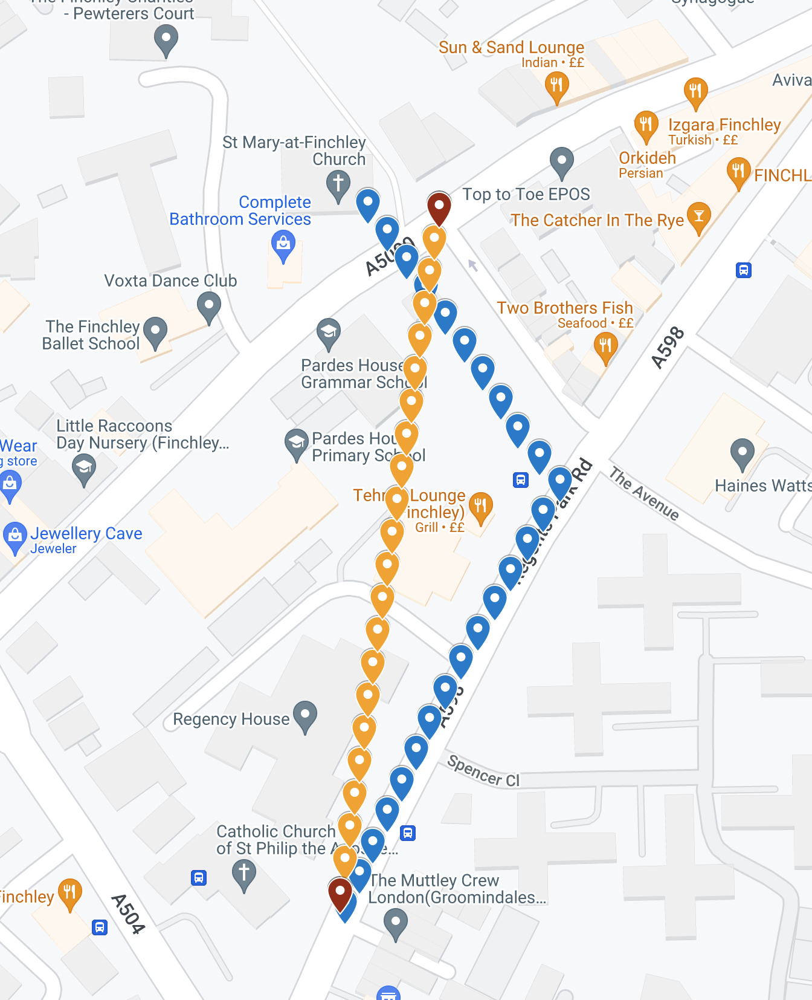

# GPS Emulator

When you are developing an application that depends on data streams from external components, the best practice is to be solution-focused and implement it in a way which removes that kind of dependency to avoid any blockers.
The GPS Emulator described here serves this exact purpose, by generating GPS data based on some input parameters and enabling your application to be developed without being dependent on the external components responsible for this task.

The GPS Emulator presented in this repository implements a REST API to:
* Generate a set of coordinates using the [Azure Maps Routes API](https://learn.microsoft.com/en-us/rest/api/maps/route)
* Generate a set of coordinates by making computations on the provided input values

## Implementation
The GPS emulator contains the following components:
* A main file which implements the REST API using the [FastAPI](https://fastapi.tiangolo.com/) web framework
* A service used  for generating the coordinates and interacting with the Azure Maps API
* A configuration file to store settings

Fast API provides a great benefit as it includes an automatic interactive API documentation provided by [Swagger UI](https://github.com/swagger-api/swagger-ui). This feature allows you to easily test the implementation.
Both endpoints will return the coordinates list in the response and also export them to CSV files.

### GET /coordinates-azure-maps
##### Summary:
Generates GPS coordinates using Azure Maps Routes API
##### Description:
The endpoint uses the [Route Directions API](https://learn.microsoft.com/en-us/rest/api/maps/route/get-route-directions?tabs=HTTP) to retrieve the distance and a list of points between the given start and stop coordinates. This endpoint requires a minimum of 2 positions and does not accept any speed input parameters. The response includes a list of points along that route, but it can not be used in our scenario, as we require our coordinates to be determined based on a specified speed and frequency.

We compute one set of coordinates at a time, starting from the first point returned by the API, taking into consideration the distance between two points and a bearing.
To achieve an accurate direction, the set of points returned by the API call is used to update the bearing at each step. However, for coordinates that are really close (only a few meters apart), the API will only return two points, hence the bearing value will remain unchanged.

##### Parameters

| Name | Located in | Description | Required | Schema |
| ---- | ---------- | ----------- | -------- | ---- |
| start_lat | query |  Latitude of the starting point | Yes | float |
| start_lon | query |  Longitude of the starting point | Yes | float |
| stop_lat | query |  Latitude of the stopping point | Yes | float |
| stop_lon | query |  Longitude of the stopping point | Yes | float |
| speed | query |  Speed in meters per second. Default value is 1. | No | float |
| frequency | query |  The interval in seconds at which we want to generate coordinates. Default value is 1. | No | float |

##### Responses

| Code | Description |
| ---- | ----------- |
| 200 | Successful Response |
| 422 | Validation Error |

### GET /coordinates-compute
##### Summary:
Generates GPS coordinates by making computations on input values
##### Description:
This endpoint uses [geopy](https://pypi.org/project/geopy/) to compute the distance between the input points. In comparison to the previous implementation, this endpoint starts from the given start point and computes the bearing just once, between the input start and stop. As a result, the generated coordinates always represent a straight line on the map.

##### Parameters

| Name | Located in | Description | Required | Schema |
| ---- | ---------- | ----------- | -------- | ---- |
| start_lat | query |  Latitude of the starting point | Yes | float |
| start_lon | query |  Longitude of the starting point | Yes | float |
| stop_lat | query |  Latitude of the stopping point | Yes | float |
| stop_lon | query |  Longitude of the stopping point | Yes | float |
| speed | query |  Speed in meters per second. Default value is 1. | No | float |
| frequency | query |  The interval in seconds at which we want to generate coordinates. Default value is 1. | No | float |

##### Responses

| Code | Description |
| ---- | ----------- |
| 200 | Successful Response |
| 422 | Validation Error |


## Results
When generating the coordinates using Azure Maps REST API it's important to keep in mind that the results may not exactly match the input points, as the API returns the closest possible values. These coordinates will also follow a path that is accessible based on the selected the travel mode: car, pedestrian, or other. 

In scenarios where you don't need to take into consideration the travel mode or your start and stop points are in field, computing the coordinates might be more suitable option. In such cases, the generated coordinates will always represent a straight line between start and stop points.

The image below illustrates a set of start and stop points, highlighted in dark red. The coordinates generated using the Azure Maps API endpoint are shown in blue, and those generated using the compute option are shown in orange. You can also note from this image that the number of coordinates produced using the Azure Maps approach will be greater as the path length is increased.


## Prerequisites
First, you need to obtain an Azure Maps API key. You can do this by following the instructions on the Azure Maps [website](https://learn.microsoft.com/en-us/azure/azure-maps/how-to-manage-account-keys). Once you have a subscription key you need to assign it to 'AZURE_MAPS_SUBSCRIPTION_KEY' in the settings file. 

Currently, the settings file contains one more field which defines the travel mode. This is set to 'pedestrian' for now but it can be updated to match your scenario.

Before being able to run this code make sure you've installed all the dependencies:
```sh
pip install 'fastapi[all]'
pip install geopy - used to retrieve the distance between 2 GPS coordinates
```

## Running the REST API locally
To run the live server you need to execute the following command under the root folder:
```sh
 uvicorn main:app --reload
 ```
Open your browser at  http://127.0.0.1:8000.

Navigate to the docs:  http://127.0.0.1:8000/docs.

## Conclusion
In summary, the GPS emulator presented helps to eliminate the dependencies on external components for supplying GPS data to your application.
This can be adapted to various scenarios by adjusting the speed and the number of coordinates required by your application. It can also be easily extended by adding additional endpoints which may use other external APIs to generate coordinates.